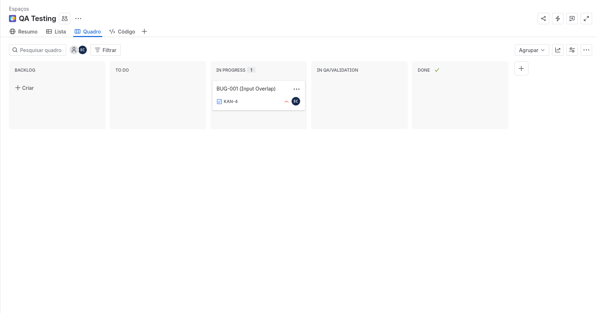
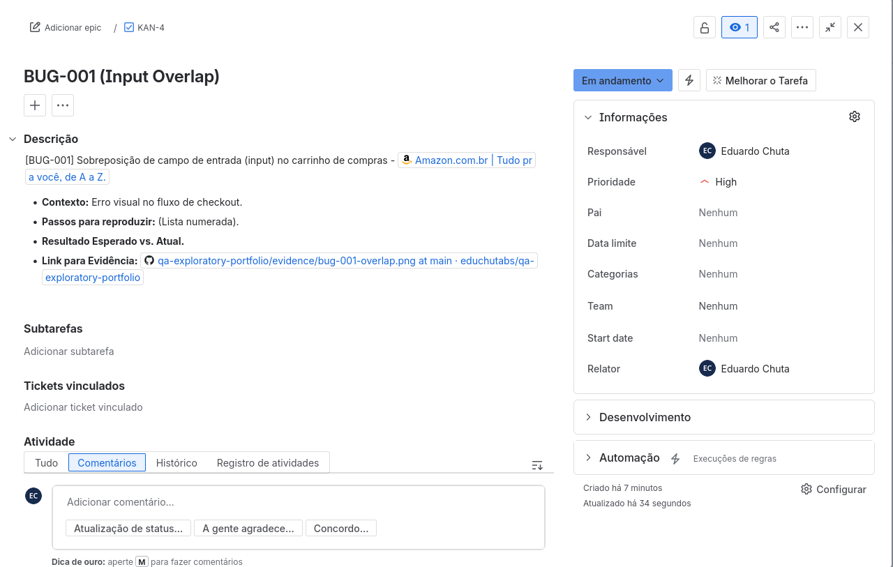

# Tooling & Quality Management

Este documento detalha as ferramentas e metodologias de gestão utilizadas para garantir o rastreio e a visibilidade dos processos de qualidade.

## Jira & Agile Management

* **Curso:** Get the Most out of Jira (Atlassian University)
* **Status:** Concluído em Abril de 2026

### Implementação de Kanban Board
Para a gestão das tarefas deste roadmap, configurei um ambiente Jira focado em visibilidade e fluxo contínuo.

**Configuração do Workflow:**

* **Backlog:** Ideias e novos cenários de teste.
* **To Do:** Tarefas priorizadas para a semana.
* **In Progress:** Atividades em execução.
* **In QA/Validation:** Fase de revisão de artefatos ou re-teste de bugs.
* **Done:** Tarefas finalizadas e documentadas.

**Evidência de Configuração:**

### Key Takeaways (Aprendizados Chave)

* Gerenciamento de Work Items (Epics, Stories, Bugs e Tasks).
* Utilização de JQL (Jira Query Language) para filtros básicos usando Rovo.
* Importância da transparência do board para stakeholders e time de desenvolvimento.
